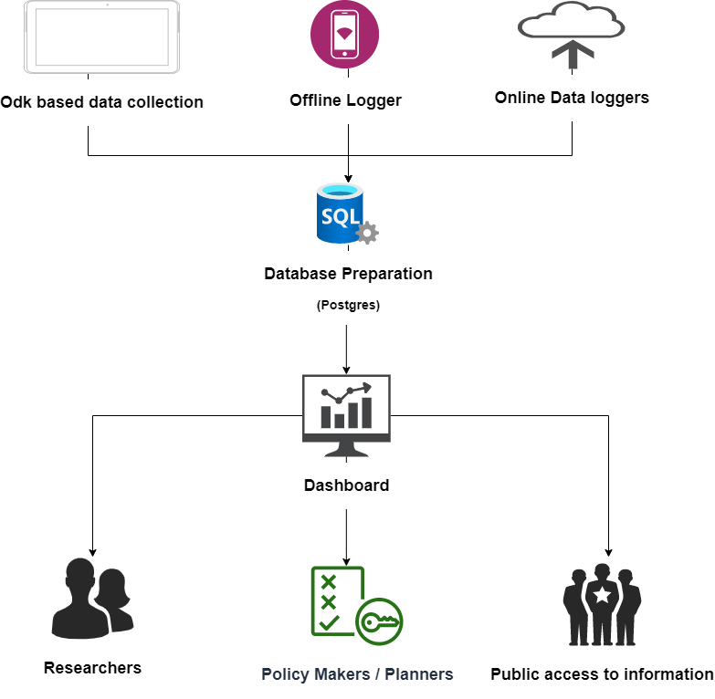

# Nepal Groundwater Monitoring Dashboard


## Background

The code of this repository is a product of the CSISA-Resilience project in partnership with Nepal’s Groundwater Resources Development Board and aims to contribute to Nepal’s capacity to operate a digital groundwater monitoring system through a small pilot project in the USAID Feed the Future Zone of Nepal’s Tarai region. The ongoing expansion of groundwater resources development will undoubtedly provide great contribution to Nepal’s irrigation sector and food security. Along this way, a digital groundwater monitoring system will be critical to help the country guide the development and management of the resource by providing decision-makers and communities with adequate spatial evidence and information about the opportunities and risks for sustainable and equitable groundwater use.

The Cereal Systems Initiative in South Asia (CSISA; www.csisa.org) is supported by USIAD and the Bill and Melinda Gates Foundation and is led by the International Maize and Wheat Improvement Center (CIMMYT) and implemented jointly with the International Water Management Institute (IWMI), International Food Policy Research Institute (IFPRI) and the International Rice Research Institute (IRRI). In Nepal, new support from USAID has led to the implementation of the CSISA Covid-19 Response and Resilience Activity (CSISA-Resilience), which is also implemented with Texas A&M University, Cornell University, and International Development Enterprises (iDE). CSISA-Resilience involves two inter-linked objectives that address CSISA’s strengths in core areas needed to assist in COVID-19 response and recovery, as well as Nepal’s longer-term building of processes and structures that can enhance resilience to shocks, with emphasis empowering youth and overcoming challenges faced by women headed farm households. The views expressed on this website do not necessarily reflect the views of the donors.## We be listing the procedure for setup of project later on.

## Work flow diagram

<p align="center">

</p>

## Open use and extenditibility

Although this dashboard has been developed specifically for Nepal and contains Nepal specific data, it can be quickly adjusted for any other context and data collection environment. Doing so merely requires updating the ODK API for accessing the collected data, ensuring that the fields of the data collections are correct and adjusting the graphs of interest. The idea is for this to be a rapid and low-maintenance solution that compelemnts more heavy and  

We licenced this project openly with the MIT Licence. Please feel free to contribute to and extend the project to fit your needs. If you do so we appreciate your getting in touch with us. We particularly encourage the usage of this code to build rapid, hyper flexible, and open data system that compelemnts more general and heavy-weight open-source solutions.

For displaying different graphs, the dashboard can be easily extended. Adding JavaScript graphs can follow the same patterns as implemented already. Some users might prefer to use python for generating interactive graphs and can do so by extending the requirements.txt and simply following the subsequent procedure: For example, one can write a function to generate either graph images or interactive HTML output through e.g. matplotlib, bokeh, or plotly. This function can then be called in the view to generate the output of interest and then included in the relevant html template sections.


## Installation
Please configure .env file for your configuration. Rename .env_sample file to .env and make the changes for credentials and kobo url

```
USER=postgres
PASSWORD=krishna
kobo_url=https://kobo_url_here.com
kobo_password=Kobo_password_here
kobo_username=Kobo_username_here
site_url
```

For installation one merely requires Docker and Docker Compose to be installed. The website can then be started by running:
```
docker-compose up
```

When the website is running for the first time, the database needs to first be restored by logging into the db container and executing a restore with the following sequence of commands in your terminal:
```
docker exec -it groundwater_db_1 /bin/bash  #entering the db container shell
su postgres #switching to postgress user
psql -U postgres -f /opt/groundwater.sql #restoring the database
```
Potentially, the container name 'goundwater_db_1' has to be adjusted to match the local container name.


## Contact

For questions or queries please contact activity leader Anton Urfels (a.urfels@cgiar.org).


## Smaller details for reference (delete later):
Documentation for higher level issues and decision taken:
https://docs.google.com/document/d/1iPiLmMDzfiNsVfwgOoOnJweTDDF2DTpf43fIuvbWxaw/edit?usp=sharing

I addedd the schema to a Google Sheet:
https://docs.google.com/spreadsheets/d/1MfJqkCz7o-e7jgZG_KTTIiDoeIAfE5WgPWRdj4R6swQ/edit?usp=sharing

Will still be expanded, but can get started from here.


# restore database in postgres
# location of groundwater.sql must be inside /var/lib/postgresql

psql groundwater < groundwater.sql

#this command restore backed up database to the existing database named "groundwater"


docker cp ./database/well_type_update.sql groundwater_db_1:/opt/


# docker commands

docker exec -it groundwater_1_db /bin/bash
groundwater_1_db is the container name
you can use docker ps -a    to list all containers and names
su postgres
psql
